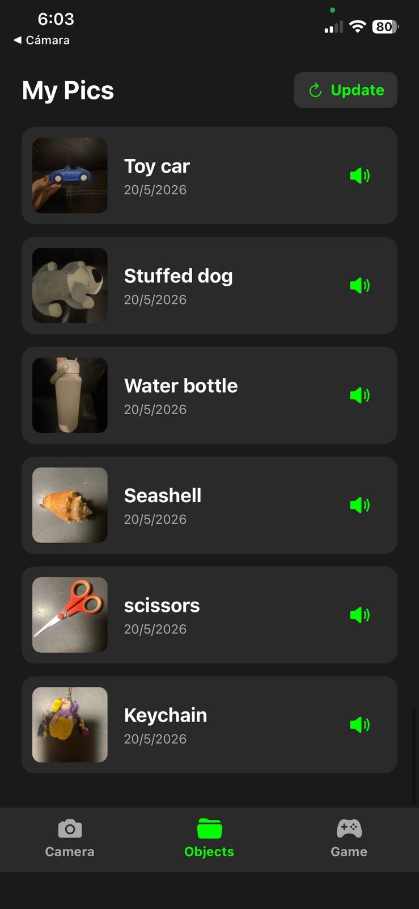
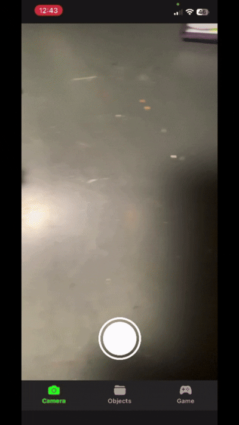
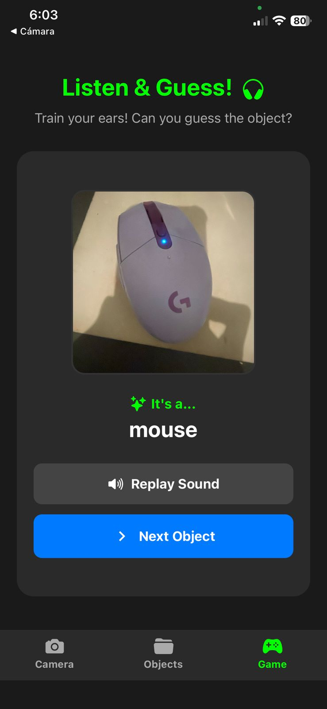

# Kiri AI

<p align="center">
  <strong>An intelligent mobile application for object detection and language learning through image analysis.</strong>
</p>

<p align="center">
  
  
  


</p>

---


**Kiri AI** is an educational mobile application designed to help children strengthen their English vocabulary through interactive visual learning. The core of the application lies in its integration with Microsoft Florence-2, a pre-trained vision-language model. Instead of relying on costly and restrictive cloud AI APIs, Kiri AI connects to a dedicated local inference server. This architecture allows the app to process image analysis requests seamlessly, offering a scalable, cost-effective, and controlled environment for AI-driven education.

### Key Features
*  **Local Object Detection:** Instantly identifies objects in real-time
*  **Contextual Language Learning:** Generates vocabulary, translations, and contextual language exercises based on the detected objects.
*  **Self-Hosted Inference Architecture:** Offloads heavy AI computations from the mobile device to a dedicated local server, eliminating cloud API dependencies and platform fees.
*  **Child-Centric Vocabulary Learning:** Tailored experience to help kids discover, learn, and reinforce English words through everyday objects.


---

##  Tech Stack

* **Frontend & Mobile Framework:** React Native / Expo (TypeScript)
* **Local AI Inference:** Microsoft Florence-2 (Optimized for edge devices)
* **Data Extraction:** Structured data parsing directly from local model outputs.

---

##   Highlights

* **Client-Server AI Pipeline:** Successfully decoupled the heavy machine learning workload by building a local server infrastructure. The React Native app handles the user experience, while the local Python backend executes the Florence-2 model weights.
* **Structured Data Parsing:** Implemented custom post-processing to transform raw local model text outputs into clean, structured JSON data to dynamically render the UI and learning modules.

---

##  Installation & Setup

Follow these steps to run the project locally.

### Prerequisites
* Node.js (v18 or higher recommended)
* Expo CLI (`npm install -g expo-cli`)
* A physical device with the Expo Go app or an emulator (Android/iOS)

### Step-by-Step Guide

1. Clone the repository:
   ```bash
   git clone [https://github.com/kLopezRamos/kiri-ai.git](https://github.com/kLopezRamos/kiri-ai.git)
   cd kiri-ai

2. Install dependencies:
   ```bash
   npm install
3. Start the development server:
   ```bash
   npx expo start
   
